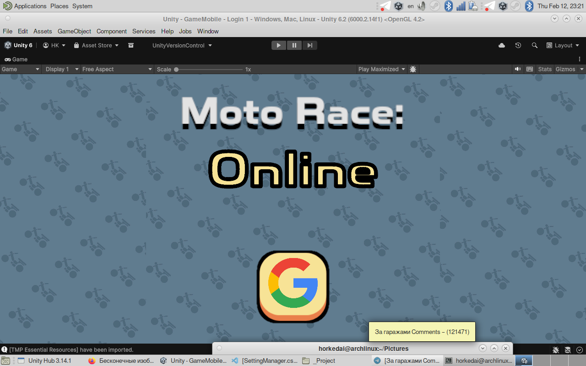

# GameMobile
 Розробка мобільної онлайн гри на мові C#.
 
Моя ціль зробити автономну гру з асинхронним онлайном. Тобто на серверах зберігаються дані аккаунта гравця, а для того щоб зробити вид гри з другими гравцями, я буду використовувати систему привида. Тобто замість того щоб в реальному часі передавати дані про положення граця на трассі, я буду зберігати просто основні характеристики і записувати на сервер. А потім ганятися просто з загруженим із серверу одним файлом привидом гравця.

Форма заходу в гру:

# Технології:
1. Unity
2. Firebase
3. GoogleSingIn

# RoadMap проекту:
1. Створити меню.
2. Створити безкінечну трассу.
3. Запровадити онлайн
4. Система привидів

Автор: Кеда Максим
